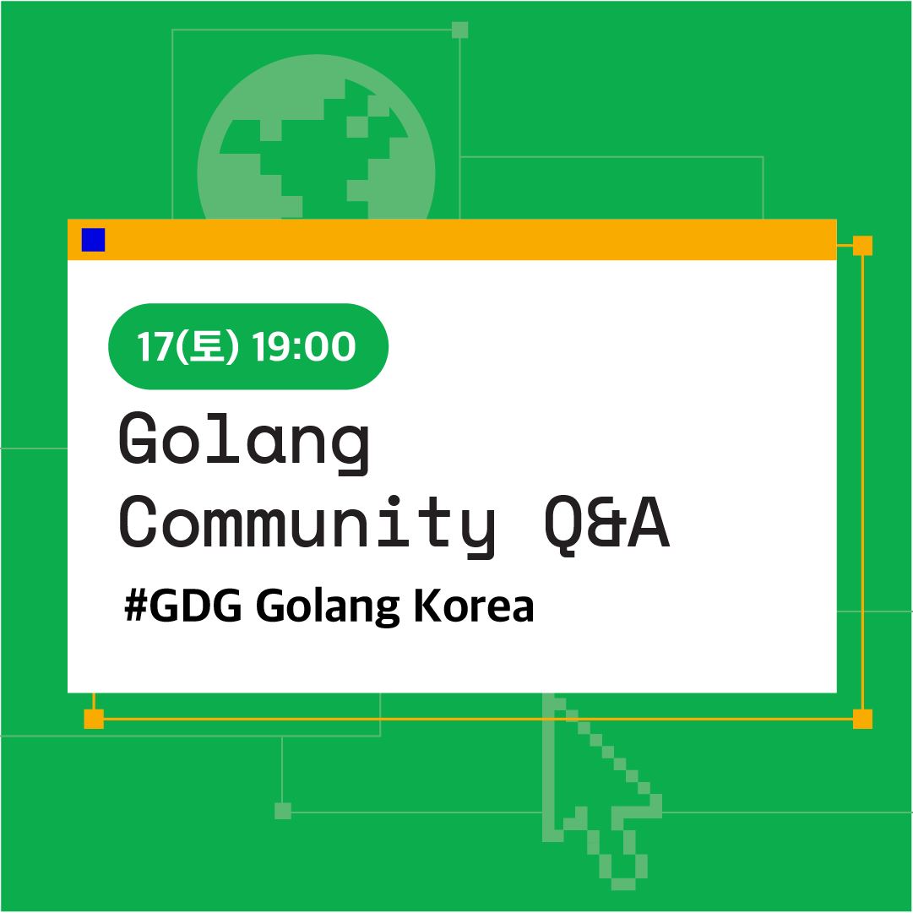

# Devfest Korea 2020 Golang Community Q&A

평소 궁금했던 Go와 관련된 질문들을 커뮤니티 멤버들과 함께 주고 받아요!

행사 기간동안 주고 받은 질문과 답변 수에 따라 선물을 드립니다!

## 참여 방법
1. [링크](https://gdg.community.dev/events/details/google-gdg-golang-korea-presents-devfest-korea-2020-golang-community-qa/)를 통해 이벤트 참가 신청을 해주세요!
    1. 이벤트 신청 폼의 `Email`, `Github username`은 이벤트 참여 확인 및 선물 증정을 위해 꼭 필요해요.
    2. 신청 중 어려운 점이 있으시면 페이스북 [GDG Golang Korea 페이지](https://www.facebook.com/gdggo)에 메세지를 남겨주세요.
2. [이슈](https://github.com/golangkorea/devfest2020-golang-community-qna/issues)를 통해 자유롭게 질문과 답변을 주고 받아요!
    1. 이슈를 만들기 전 이미 동일한 질문이 이슈로 만들어져 있는지 확인해주세요.
    2. 선물 증정을 위한 질문과 답변 수는 **10/17 20:00**를 기준으로 집계돼요.
    3. 답변 수는 코멘트가 아니라 코멘트를 남긴 이슈의 수로 집계돼요.
3. **10/17 19:00** 라이브 방송에서 운영진들과 함께 라이브로 질문과 답변을 읽으며 의견을 나눠봐요!
